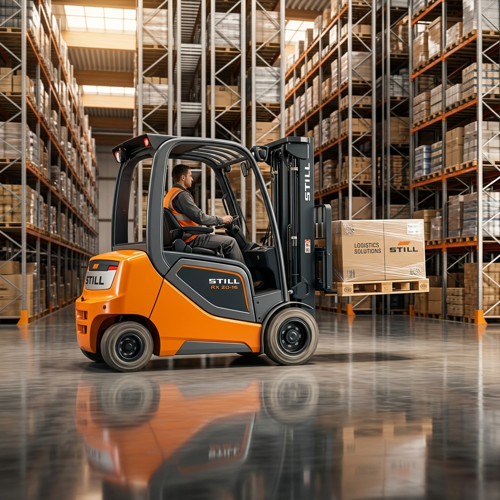
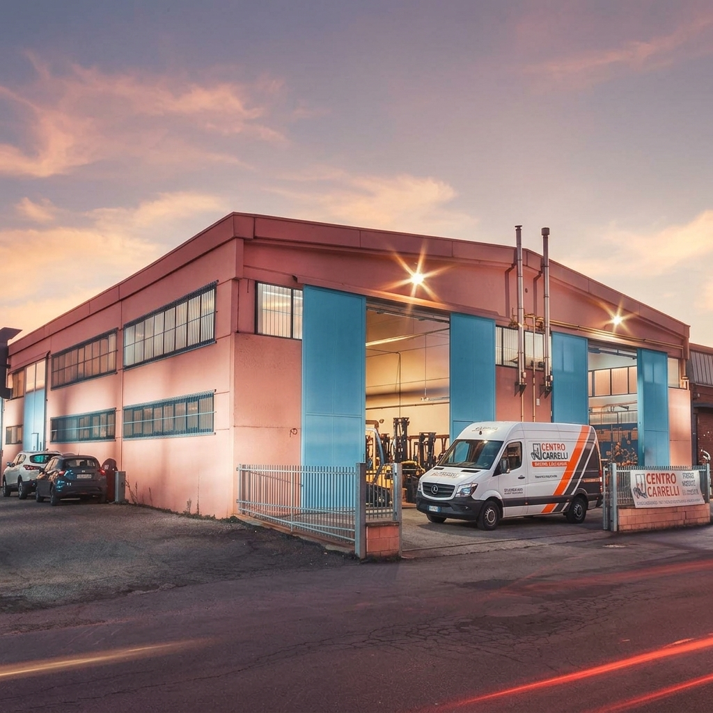

# Progetto Centro Carrelli - Mockup Grafico STILL Style

Questo file contiene l'intero contesto e il codice sorgente del prototipo della landing page per **Centro Carrelli S.r.l.**, sviluppato prendendo ispirazione dal design e dalla brand identity di **STILL.it** per celebrare i 30 anni dell'azienda (1996 - 2026).

Puoi passare questo file direttamente a **Claude** per fargli comprendere l'architettura, lo stile e la logica applicativa del progetto ed effettuare modifiche o estensioni.

---

## Struttura del Progetto

```text
centrocarrelli/
├── index.html          # Struttura HTML5 della landing page
├── style.css           # Foglio di stile personalizzato (STILL-inspired, responsive, accessibile)
├── app.js              # Logica del Configuratore (Forklift Finder) e animazioni
└── assets/             # Immagini del catalogo e di sfondo (generate via AI)
    ├── hero_forklift.png
    ├── ech_transpallet.png
    └── service_van.png
```

---

## 1. Struttura HTML (`index.html`)

```html
<!DOCTYPE html>
<html lang="it">
<head>
    <meta charset="UTF-8">
    <meta name="viewport" content="width=device-width, initial-scale=1.0">
    <title>Centro Carrelli - Soluzioni Intralogistiche & Partner STILL</title>
    <meta name="description" content="Vendita, noleggio e assistenza carrelli elevatori e transpallet a Bologna. Partner ufficiale STILL dal 1996. Scopri il nostro mockup grafico moderno per il 30° anniversario.">
    <link rel="stylesheet" href="style.css">
</head>
<body>

    <!-- Header Navigation -->
    <header class="nav-header" id="nav-header">
        <div class="nav-container">
            <a href="#" class="nav-logo" aria-label="Centro Carrelli Home">
                CENTRO<span>CARRELLI</span>
                <span class="badge-30">30 Anni</span>
            </a>
            
            <button class="hamburger" aria-label="Apri menu di navigazione" aria-expanded="false" aria-controls="nav-menu">
                <span></span>
                <span></span>
                <span></span>
            </button>

            <ul class="nav-menu" id="nav-menu">
                <li class="nav-item"><a href="#">Home</a></li>
                <li class="nav-item"><a href="#finder">Trova Carrello</a></li>
                <li class="nav-item"><a href="#storia">Chi Siamo</a></li>
                <li class="nav-item"><a href="#servizi">Assistenza</a></li>
                <li class="nav-item"><a href="#articoli">News</a></li>
                <li class="nav-cta"><a href="#contatti" class="btn btn-primary">Richiedi Preventivo</a></li>
            </ul>
        </div>
    </header>

    <!-- Hero Section -->
    <section class="hero-section" id="home">
        <div class="hero-container">
            <div class="hero-content animate-on-scroll">
                <span class="hero-subtitle">Partner Ufficiale STILL</span>
                <h1 class="hero-title">Rivoluziona la tua <span>Logistica Interna</span></h1>
                <p class="hero-description">
                    Sistemi di movimentazione all'avanguardia, noleggio flessibile a breve e lungo termine, ed assistenza tecnica certificata. L'eccellenza ingegneristica di STILL sposa la nostra affidabilità sul territorio da trent'anni.
                </p>
                <div class="hero-actions">
                    <a href="#finder" class="btn btn-primary">Configura il tuo Mezzo</a>
                    <a href="#contatti" class="btn btn-secondary" style="border-color: #ffffff; color: #ffffff;">Contatta un Esperto</a>
                </div>
            </div>
            
            <div class="hero-image-wrapper animate-on-scroll">
                <div class="hero-image-container">
                    
                </div>
                <div class="hero-badge">
                    <div class="badge-num">30</div>
                    <div class="badge-txt">Anni di Efficienza<br>1996 - 2026</div>
                </div>
            </div>
        </div>
    </section>

    <!-- Information Strip -->
    <div class="info-strip">
        <div class="info-strip-container">
            <div class="info-item">
                <div class="info-icon" aria-hidden="true">⏱️</div>
                <div class="info-text">
                    <h4>Intervento in 4 Ore</h4>
                    <p>Assistenza rapida su Bologna e provincia</p>
                </div>
            </div>
            <div class="info-item">
                <div class="info-icon" aria-hidden="true">🔋</div>
                <div class="info-text">
                    <h4>Pionieri del Litio</h4>
                    <p>Tecnologia STILL Li-Ion ad alta efficienza</p>
                </div>
            </div>
            <div class="info-item">
                <div class="info-icon" aria-hidden="true">📦</div>
                <div class="info-text">
                    <h4>500+ Mezzi Disponibili</h4>
                    <p>Flotta noleggio pronta per picchi stagionali</p>
                </div>
            </div>
            <div class="info-item">
                <div class="info-icon" aria-hidden="true">🛠️</div>
                <div class="info-text">
                    <h4>Ricambi Originali</h4>
                    <p>Manutenzione certificata a marchio STILL</p>
                </div>
            </div>
        </div>
    </div>

    <!-- Forklift Finder Section -->
    <section class="finder-section" id="finder">
        <div class="section-container">
            <div class="section-header animate-on-scroll">
                <span class="section-tag">Trova il Mezzo Ideale</span>
                <h2 class="section-title">Configura la tua flotta in pochi click</h2>
                <p class="section-subtitle">Seleziona le caratteristiche del tuo ambiente di lavoro e scopri quale carrello elevatore STILL garantisce le massime prestazioni per le tue esigenze intralogistiche.</p>
            </div>

            <!-- Finder Widget -->
            <div class="finder-widget animate-on-scroll">
                
                <!-- Filter Sidebar -->
                <div class="finder-sidebar">
                    <h3>Filtri di Ricerca</h3>
                    <p>Modifica le impostazioni per filtrare i mezzi consigliati.</p>
                    
                    <div class="filter-group">
                        <span class="filter-label">1. Ambiente di Lavoro</span>
                        <div class="filter-options">
                            <label class="filter-btn active">
                                <input type="radio" name="ambiente" value="entrambi" checked>
                                Interno ed Esterno
                            </label>
                            <label class="filter-btn">
                                <input type="radio" name="ambiente" value="interno">
                                Solo Interno (Magazzino)
                            </label>
                            <label class="filter-btn">
                                <input type="radio" name="ambiente" value="esterno">
                                Solo Esterno (Piazzale)
                            </label>
                        </div>
                    </div>

                    <div class="filter-group">
                        <span class="filter-label">2. Operazione Principale</span>
                        <div class="filter-options">
                            <label class="filter-btn active">
                                <input type="radio" name="operazione" value="quota" checked>
                                Stoccaggio in Quota (Scaffali)
                            </label>
                            <label class="filter-btn">
                                <input type="radio" name="operazione" value="orizzontale">
                                Movimentazione Orizzontale
                            </label>
                            <label class="filter-btn">
                                <input type="radio" name="operazione" value="grandi">
                                Movimentazione Grandi Carichi
                            </label>
                        </div>
                    </div>

                    <div class="filter-group">
                        <span class="filter-label">3. Alimentazione</span>
                        <div class="filter-options">
                            <label class="filter-btn active">
                                <input type="radio" name="alimentazione" value="elettrico" checked>
                                Elettrico (Standard)
                            </label>
                            <label class="filter-btn">
                                <input type="radio" name="alimentazione" value="litio">
                                Ioni di Litio (Ricarica Rapida)
                            </label>
                            <label class="filter-btn">
                                <input type="radio" name="alimentazione" value="diesel">
                                Diesel / Gas GPL (Esterno)
                            </label>
                        </div>
                    </div>
                </div>

                <!-- Results Area -->
                <div class="finder-results">
                    <div class="results-header">
                        <span class="results-count" id="results-count">Carrelli trovati</span>
                        <button class="btn btn-secondary" style="padding: 6px 12px; font-size: 0.8rem; min-height: auto;" onclick="resetFilters()">Reset Filtri</button>
                    </div>
                    
                    <div class="results-grid" id="results-grid">
                        <!-- Dynamically filled by app.js -->
                    </div>
                </div>

            </div>
        </div>
    </section>

    <!-- 30 Years Anniversary Celebration Section -->
    <section class="anniversary-section" id="storia">
        <div class="section-container">
            <div class="anniversary-grid">
                <div class="anniversary-content animate-on-scroll">
                    <span class="section-tag" style="color: var(--color-orange);">Trent'anni Insieme</span>
                    <h2>Una storia di <span>affidabilità</span> e innovazione</h2>
                    <p>Dal 1996, Centro Carrelli è al fianco delle aziende bolognesi per garantire flussi logistici impeccabili. La nostra storia è caratterizzata dalla ricerca costante dell'efficienza e del servizio perfetto. Con l'evoluzione verso le batterie agli ioni di litio e l'automazione intralogistica, continuiamo a guidare i nostri partner verso il futuro della movimentazione delle merci.</p>
                    
                    <div class="anniversary-timeline">
                        <div class="timeline-card">
                            <div class="timeline-year">1996</div>
                            <div class="timeline-title">La Fondazione</div>
                            <div class="timeline-desc">Centro Carrelli nasce a Bentivoglio come officina riparazioni specializzata.</div>
                        </div>
                        <div class="timeline-card">
                            <div class="timeline-year">2011</div>
                            <div class="timeline-title">Partnership STILL</div>
                            <div class="timeline-desc">Diventiamo concessionario e officina partner ufficiale STILL per Bologna.</div>
                        </div>
                        <div class="timeline-card">
                            <div class="timeline-year">2026</div>
                            <div class="timeline-title">Svolta Green & Auto</div>
                            <div class="timeline-desc">Focalizzazione su transpallet al litio, carrelli elettrici e carrelli automatici AGV.</div>
                        </div>
                    </div>

                    <a href="#contatti" class="btn btn-primary">Scopri Chi Siamo</a>
                </div>

                <div class="anniversary-badge-lg animate-on-scroll">
                    <div class="anniversary-seal">
                        <div class="anniversary-seal-content">
                            <span class="years">30</span>
                            <span class="text-1">Anni di Successi</span>
                            <span class="text-2">Centro Carrelli S.r.l.<br>1996 - 2026</span>
                        </div>
                    </div>
                </div>
            </div>
        </div>
    </section>

    <!-- Services / Repair / STILL DNA Section -->
    <section class="services-section" id="servizi">
        <div class="section-container">
            <div class="services-grid">
                
                <div class="services-image-container animate-on-scroll">
                    
                </div>

                <div class="services-list animate-on-scroll">
                    <div class="section-header" style="text-align: left; margin-bottom: 40px; max-width: none;">
                        <span class="section-tag">Manutenzione Certificata</span>
                        <h2 class="section-title">L'assistenza tecnica è il nostro DNA</h2>
                        <p class="section-subtitle">Un carrello fermo è un costo operativo che blocca la tua produzione. Ecco perché abbiamo strutturato la nostra officina mobile per intervenire tempestivamente ed eliminare ogni collo di bottiglia.</p>
                    </div>

                    <div class="service-card">
                        <div class="service-num">01</div>
                        <div class="service-details">
                            <h3>Officina Mobile & Diagnostica STILL</h3>
                            <p>I nostri tecnici intervengono con furgoni attrezzati e sistemi di diagnostica computerizzata ufficiale STILL per ripristinare il mezzo direttamente in banchina.</p>
                        </div>
                    </div>

                    <div class="service-card">
                        <div class="service-num">02</div>
                        <div class="service-details">
                            <h3>Manutenzione Programmata Salva-Budget</h3>
                            <p>Piani di manutenzione preventiva studiati su misura per estendere la vita utile del tuo carrello, prevenire guasti straordinari e programmare i costi.</p>
                        </div>
                    </div>

                    <div class="service-card">
                        <div class="service-num">03</div>
                        <div class="service-details">
                            <h3>Controlli di Sicurezza Obbligatori</h3>
                            <p>Verifiche periodiche di sicurezza in conformità al D.Lgs. 81/08 per catene, forche e dispositivi di protezione attiva dei carrellisti, con rilascio del relativo registro.</p>
                        </div>
                    </div>
                </div>

            </div>
        </div>
    </section>

    <!-- Articles Section -->
    <section class="articles-section" id="articoli">
        <div class="section-container">
            <div class="section-header animate-on-scroll">
                <span class="section-tag">Logistica & Approfondimenti</span>
                <h2 class="section-title">Consigli dai nostri tecnici</h2>
                <p class="section-subtitle">Rimani aggiornato sulle ultime novità in tema di intralogistica, normative di sicurezza per carrelli e innovazioni tecnologiche nel mondo del sollevamento.</p>
            </div>

            <div class="articles-grid animate-on-scroll">
                
                <!-- Article 1 (Transpallet ECH) -->
                <article class="article-card">
                    <div class="article-header">
                        <span class="article-date">Focus Prodotto</span>
                    </div>
                    <div class="article-body">
                        <h3 class="article-title">Transpallet STILL ECH: agilità imbattibile nei corridoi stretti</h3>
                        <p class="article-excerpt">Come abbattere i tempi di trasferimento interno e lo sforzo fisico degli operatori con la serie ECH a batteria al litio estraibile.</p>
                        <a href="#contatti" class="article-link">Leggi Articolo <span>→</span></a>
                    </div>
                </article>

                <!-- Article 2 (Litio vs Piombo) -->
                <article class="article-card">
                    <div class="article-header">
                        <span class="article-date">Tecnologia</span>
                    </div>
                    <div class="article-body">
                        <h3 class="article-title">Batterie al Litio vs Piombo-Acido: qual è la scelta migliore?</h3>
                        <p class="article-excerpt">Analisi economica e funzionale sulle batterie per carrelli elevatori. Costi di ricarica, manutenzione e sicurezza a confronto per il 2026.</p>
                        <a href="#contatti" class="article-link">Leggi Articolo <span>→</span></a>
                    </div>
                </article>

                <!-- Article 3 (Controlli Sicurezza) -->
                <article class="article-card">
                    <div class="article-header">
                        <span class="article-date">Sicurezza</span>
                    </div>
                    <div class="article-body">
                        <h3 class="article-title">Controlli di sicurezza quotidiani sul carrello elevatore</h3>
                        <p class="article-excerpt">La checklist operativa per i carrellisti prima di iniziare il turno. Manutenzione ordinaria ed accorgimenti salvavita nei magazzini.</p>
                        <a href="#contatti" class="article-link">Leggi Articolo <span>→</span></a>
                    </div>
                </article>

            </div>

            <div class="articles-cta-container animate-on-scroll">
                <a href="#contatti" class="btn btn-secondary">Vedi Tutti gli Articoli</a>
            </div>
        </div>
    </section>

    <!-- Contact Section -->
    <section class="contact-section" id="contatti">
        <div class="section-container">
            <div class="contact-grid">
                
                <div class="contact-info-panel animate-on-scroll">
                    <span class="section-tag" style="color: var(--color-orange);">Richiedi Consulenza</span>
                    <h2>Parla con un nostro specialista logistico</h2>
                    <p>Sia che tu stia cercando un transpallet agile per il tuo negozio, un carrello frontale ad alte prestazioni a noleggio, o un servizio di assistenza tecnica rapido, il nostro team risponde in pochi minuti.</p>
                    
                    <div class="contact-details">
                        <div class="contact-detail-item">
                            <div class="contact-detail-icon" aria-hidden="true">📞</div>
                            <div class="contact-detail-text">
                                <h4>Telefono Ufficio</h4>
                                <p><a href="tel:+39051860066">+39 051 860066</a></p>
                            </div>
                        </div>
                        <div class="contact-detail-item">
                            <div class="contact-detail-icon" aria-hidden="true">✉️</div>
                            <div class="contact-detail-text">
                                <h4>Email Richieste</h4>
                                <p><a href="mailto:info@centrocarrelli.net">info@centrocarrelli.net</a></p>
                            </div>
                        </div>
                        <div class="contact-detail-item">
                            <div class="contact-detail-icon" aria-hidden="true">📍</div>
                            <div class="contact-detail-text">
                                <h4>Sede Operativa</h4>
                                <p>Via R. Viganò 10, 40010 Bentivoglio (BO)</p>
                            </div>
                        </div>
                    </div>

                    <div class="social-links">
                        <a href="#" class="social-btn" aria-label="Facebook Centro Carrelli">F</a>
                        <a href="#" class="social-btn" aria-label="LinkedIn Centro Carrelli">L</a>
                        <a href="#" class="social-btn" aria-label="Instagram Centro Carrelli">I</a>
                    </div>
                </div>

                <!-- Contact Form Wrapper (Styled like Contact Form 7 but premium) -->
                <div class="contact-form-wrapper animate-on-scroll">
                    <h3>Scrivici un messaggio</h3>
                    <p>Compila il modulo sottostante, verrai ricontattato entro 1 ora lavorativa.</p>
                    
                    <form action="#" class="wpcf7-form" id="contact-form" onsubmit="event.preventDefault(); alert('Grazie per averci contattato! Il team di Centro Carrelli risponderà al più presto.');">
                        <div class="form-grid">
                            <div class="form-group">
                                <label for="form-name">Nome e Cognome *</label>
                                <input type="text" id="form-name" class="form-control" placeholder="Inserisci il tuo nome" required>
                            </div>
                            <div class="form-group">
                                <label for="form-company">Azienda</label>
                                <input type="text" id="form-company" class="form-control" placeholder="Ragione sociale">
                            </div>
                            <div class="form-group">
                                <label for="form-email">Indirizzo Email *</label>
                                <input type="email" id="form-email" class="form-control" placeholder="tuaemail@azienda.com" required>
                            </div>
                            <div class="form-group">
                                <label for="form-phone">Telefono *</label>
                                <input type="tel" id="form-phone" class="form-control" placeholder="Numero di telefono" required>
                            </div>
                            <div class="form-group form-full">
                                <label for="form-service">Servizio d'Interesse</label>
                                <select id="form-service" class="form-control" style="background-color: rgba(18, 19, 22, 0.6); color: #FFF; border: 1px solid rgba(255,255,255,0.15);">
                                    <option value="noleggio">Noleggio Carrello Elevatore</option>
                                    <option value="acquisto">Acquisto Nuovo / Usato</option>
                                    <option value="assistenza">Assistenza Tecnica / Manutenzione</option>
                                    <option value="sicurezza">Controlli Sicurezza ed Catene</option>
                                    <option value="altro">Altro</option>
                                </select>
                            </div>
                            <div class="form-group form-full">
                                <label for="form-message">Come possiamo aiutarti? *</label>
                                <textarea id="form-message" class="form-control" placeholder="Scrivi qui i dettagli della tua richiesta..." required></textarea>
                            </div>
                            <div class="form-group form-full form-privacy">
                                <input type="checkbox" id="privacy-check" required>
                                <label for="privacy-check">Accetto il trattamento dei dati personali secondo la <a href="#">Privacy Policy</a> di Centro Carrelli S.r.l. *</label>
                            </div>
                            <div class="form-group form-full" style="margin-top: 10px;">
                                <button type="submit" class="btn btn-primary" style="width: 100%;">Invia Richiesta</button>
                            </div>
                        </div>
                    </form>
                </div>

            </div>
        </div>
    </section>

    <!-- Footer -->
    <footer class="footer-bottom">
        <div class="footer-container">
            <p>&copy; 2026 Centro Carrelli S.r.l. - Via R. Viganò 10, Bentivoglio (BO) - P.IVA 01234567890. Concessionario STILL Ufficiale.</p>
            <ul class="footer-links">
                <li><a href="#">Privacy Policy</a></li>
                <li><a href="#">Cookie Policy</a></li>
                <li><a href="#">Contatti</a></li>
            </ul>
        </div>
    </footer>

    <script src="app.js"></script>
</body>
</html>
```

---

## 2. Foglio di Stile CSS (`style.css`)

```css
/* ==========================================================================
   CENTRO CARRELLI - STILL INSPIRED BRAND SYSTEM & STYLES (2026)
   ========================================================================== */

/* Import modern geometric and clean typography from Google Fonts */
@import url('https://fonts.googleapis.com/css2?family=Inter:wght@300;400;500;600;700&family=Outfit:wght@400;500;600;700;800;900&display=swap');

/* Brand Design Tokens */
:root {
    --color-orange: #FF5900;
    --color-orange-hover: #E04E00;
    --color-orange-glow: rgba(255, 89, 0, 0.2);
    --color-dark-carbon: #121316;
    --color-dark-surface: #1E2026;
    --color-dark-card: #282A32;
    --color-light-bg: #F8FAFC;
    --color-light-surface: #FFFFFF;
    --color-light-border: #E2E8F0;
    --color-text-dark: #1E293B;
    --color-text-light: #F1F5F9;
    --color-text-muted: #64748B;
    --font-heading: 'Outfit', -apple-system, BlinkMacSystemFont, "Segoe UI", Roboto, sans-serif;
    --font-body: 'Inter', -apple-system, BlinkMacSystemFont, "Segoe UI", Roboto, sans-serif;
    --transition-smooth: all 0.3s cubic-bezier(0.4, 0, 0.2, 1);
    --border-radius-sm: 4px;
    --border-radius-md: 8px;
    --border-radius-lg: 16px;
    --shadow-sm: 0 2px 4px rgba(0, 0, 0, 0.05);
    --shadow-md: 0 10px 15px -3px rgba(0, 0, 0, 0.1), 0 4px 6px -2px rgba(0, 0, 0, 0.05);
    --shadow-lg: 0 20px 25px -5px rgba(0, 0, 0, 0.15), 0 10px 10px -5px rgba(0, 0, 0, 0.04);
    --shadow-glow: 0 0 20px rgba(255, 89, 0, 0.3);
}

/* Global resets & base setup */
* {
    margin: 0;
    padding: 0;
    box-sizing: border-box;
}

html {
    scroll-behavior: smooth;
    font-size: 16px;
}

body {
    font-family: var(--font-body);
    background-color: var(--color-light-bg);
    color: var(--color-text-dark);
    line-height: 1.6;
    overflow-x: hidden;
}

h1, h2, h3, h4, h5, h6 {
    font-family: var(--font-heading);
    color: var(--color-dark-carbon);
    font-weight: 700;
    line-height: 1.2;
}

a {
    color: inherit;
    text-decoration: none;
    transition: var(--transition-smooth);
}

/* Focus styles for keyboard accessibility */
a:focus-visible, button:focus-visible, input:focus-visible, select:focus-visible, textarea:focus-visible {
    outline: 3px solid var(--color-orange);
    outline-offset: 2px;
}

/* Base button styles */
.btn {
    display: inline-flex;
    align-items: center;
    justify-content: center;
    padding: 12px 28px;
    font-family: var(--font-heading);
    font-size: 1rem;
    font-weight: 600;
    border-radius: var(--border-radius-sm);
    cursor: pointer;
    transition: var(--transition-smooth);
    border: 2px solid transparent;
    text-transform: uppercase;
    letter-spacing: 0.5px;
    min-height: 48px; /* Touch target standard */
}

.btn-primary {
    background-color: var(--color-orange);
    color: #FFFFFF;
}

.btn-primary:hover {
    background-color: var(--color-orange-hover);
    transform: translateY(-2px);
    box-shadow: var(--shadow-glow);
}

.btn-secondary {
    background-color: transparent;
    color: var(--color-dark-carbon);
    border-color: var(--color-dark-carbon);
}

.btn-secondary:hover {
    background-color: var(--color-dark-carbon);
    color: #FFFFFF;
    transform: translateY(-2px);
}

.btn-light {
    background-color: #FFFFFF;
    color: var(--color-dark-carbon);
}

.btn-light:hover {
    background-color: var(--color-orange);
    color: #FFFFFF;
    transform: translateY(-2px);
}

/* Navigation bar - Glassmorphism & stickiness */
.nav-header {
    position: fixed;
    top: 0;
    left: 0;
    width: 100%;
    z-index: 1000;
    background-color: rgba(18, 19, 22, 0.85);
    backdrop-filter: blur(12px);
    -webkit-backdrop-filter: blur(12px);
    border-bottom: 1px solid rgba(255, 255, 255, 0.08);
    transition: var(--transition-smooth);
}

.nav-header.scrolled {
    background-color: var(--color-dark-carbon);
    padding: 10px 0;
    box-shadow: var(--shadow-md);
}

.nav-container {
    max-width: 1200px;
    margin: 0 auto;
    padding: 18px 24px;
    display: flex;
    align-items: center;
    justify-content: flex-start;
}

.nav-logo {
    display: flex;
    align-items: center;
    gap: 12px;
    font-family: var(--font-heading);
    font-weight: 800;
    font-size: 1.5rem;
    color: #FFFFFF;
}

.nav-logo span {
    color: var(--color-orange);
}

.nav-logo .badge-30 {
    font-size: 0.7rem;
    background-color: var(--color-orange);
    color: #FFFFFF;
    padding: 3px 6px;
    border-radius: var(--border-radius-sm);
    font-weight: 700;
    text-transform: uppercase;
    letter-spacing: 1px;
}

.nav-menu {
    display: flex;
    list-style: none;
    margin-left: auto;
    gap: 28px;
    align-items: center;
}

.nav-item a {
    color: rgba(255, 255, 255, 0.8);
    font-size: 0.95rem;
    font-weight: 500;
    padding: 8px 0;
    position: relative;
}

.nav-item a:hover {
    color: #FFFFFF;
}

.nav-item a::after {
    content: '';
    position: absolute;
    bottom: 0;
    left: 0;
    width: 0;
    height: 2px;
    background-color: var(--color-orange);
    transition: var(--transition-smooth);
}

.nav-item a:hover::after {
    width: 100%;
}

.nav-cta {
    margin-left: 28px;
}

/* Mobile hamburger button */
.hamburger {
    display: none;
    flex-direction: column;
    justify-content: space-between;
    width: 30px;
    height: 21px;
    background: transparent;
    border: none;
    cursor: pointer;
    padding: 0;
    margin-left: auto;
    z-index: 1010;
}

.hamburger span {
    width: 100%;
    height: 3px;
    background-color: #FFFFFF;
    border-radius: 2px;
    transition: var(--transition-smooth);
}

/* Hero Section */
.hero-section {
    position: relative;
    min-height: 100vh;
    padding-top: 100px;
    background-color: var(--color-dark-carbon);
    display: flex;
    align-items: center;
    overflow: hidden;
}

.hero-section::before {
    content: '';
    position: absolute;
    bottom: -150px;
    right: -150px;
    width: 600px;
    height: 600px;
    background: radial-gradient(circle, rgba(255, 89, 0, 0.15) 0%, rgba(0, 0, 0, 0) 70%);
    z-index: 1;
    pointer-events: none;
}

.hero-container {
    max-width: 1200px;
    margin: 0 auto;
    padding: 60px 24px;
    display: grid;
    grid-template-columns: 1.1fr 0.9fr;
    gap: 40px;
    align-items: center;
    position: relative;
    z-index: 2;
}

.hero-content {
    color: #FFFFFF;
}

.hero-subtitle {
    font-family: var(--font-heading);
    color: var(--color-orange);
    font-weight: 700;
    font-size: 1.1rem;
    text-transform: uppercase;
    letter-spacing: 2px;
    margin-bottom: 16px;
    display: inline-block;
    border-left: 3px solid var(--color-orange);
    padding-left: 10px;
}

.hero-title {
    font-size: 3.5rem;
    font-weight: 900;
    color: #FFFFFF;
    line-height: 1.1;
    margin-bottom: 24px;
    letter-spacing: -1px;
}

.hero-title span {
    color: var(--color-orange);
}

.hero-description {
    font-size: 1.15rem;
    color: rgba(255, 255, 255, 0.7);
    margin-bottom: 36px;
    max-width: 540px;
}

.hero-actions {
    display: flex;
    gap: 16px;
    flex-wrap: wrap;
}

.hero-image-wrapper {
    position: relative;
    display: flex;
    justify-content: center;
    align-items: center;
}

.hero-image-container {
    position: relative;
    width: 100%;
    max-width: 500px;
    border-radius: var(--border-radius-lg);
    overflow: hidden;
    box-shadow: var(--shadow-lg), 0 0 40px rgba(0,0,0,0.5);
    border: 1px solid rgba(255, 255, 255, 0.1);
}

.hero-image-container img {
    width: 100%;
    height: auto;
    display: block;
    transform: scale(1.02);
    transition: var(--transition-smooth);
}

.hero-image-container:hover img {
    transform: scale(1.05);
}

.hero-badge {
    position: absolute;
    bottom: -20px;
    left: -20px;
    background-color: var(--color-orange);
    color: #FFFFFF;
    padding: 20px 24px;
    border-radius: var(--border-radius-md);
    box-shadow: var(--shadow-lg);
    font-family: var(--font-heading);
    z-index: 10;
    border: 1px solid rgba(255, 255, 255, 0.1);
}

.hero-badge .badge-num {
    font-size: 2.2rem;
    font-weight: 900;
    line-height: 1;
}

.hero-badge .badge-txt {
    font-size: 0.8rem;
    text-transform: uppercase;
    font-weight: 700;
    letter-spacing: 1px;
}

/* Highlight / Features bar */
.info-strip {
    background-color: var(--color-dark-surface);
    border-bottom: 4px solid var(--color-orange);
    color: #FFFFFF;
    padding: 30px 0;
}

.info-strip-container {
    max-width: 1200px;
    margin: 0 auto;
    padding: 0 24px;
    display: grid;
    grid-template-columns: repeat(4, 1fr);
    gap: 30px;
}

.info-item {
    display: flex;
    align-items: center;
    gap: 16px;
}

.info-icon {
    font-size: 2rem;
    color: var(--color-orange);
    display: flex;
    align-items: center;
    justify-content: center;
}

.info-text h4 {
    color: #FFFFFF;
    font-size: 1.1rem;
    margin-bottom: 2px;
}

.info-text p {
    color: rgba(255,255,255,0.6);
    font-size: 0.85rem;
}

/* Configuratore "Forklift Finder" */
.finder-section {
    padding: 100px 0;
    background-color: var(--color-light-bg);
}

.section-container {
    max-width: 1200px;
    margin: 0 auto;
    padding: 0 24px;
}

.section-header {
    text-align: center;
    max-width: 700px;
    margin: 0 auto 60px auto;
}

.section-tag {
    color: var(--color-orange);
    font-weight: 800;
    font-size: 0.9rem;
    text-transform: uppercase;
    letter-spacing: 1.5px;
    margin-bottom: 12px;
    display: block;
}

.section-title {
    font-size: 2.6rem;
    font-weight: 800;
    margin-bottom: 18px;
    letter-spacing: -0.5px;
}

.section-subtitle {
    color: var(--color-text-muted);
    font-size: 1.1rem;
}

/* Finder Widget */
.finder-widget {
    background-color: var(--color-light-surface);
    border-radius: var(--border-radius-lg);
    box-shadow: var(--shadow-md);
    border: 1px solid var(--color-light-border);
    display: grid;
    grid-template-columns: 350px 1fr;
    overflow: hidden;
    min-height: 550px;
}

.finder-sidebar {
    background-color: var(--color-dark-surface);
    color: #FFFFFF;
    padding: 40px 30px;
}

.finder-sidebar h3 {
    color: #FFFFFF;
    font-size: 1.4rem;
    margin-bottom: 8px;
    border-bottom: 2px solid var(--color-orange);
    padding-bottom: 10px;
}

.finder-sidebar p {
    color: rgba(255, 255, 255, 0.6);
    font-size: 0.9rem;
    margin-bottom: 30px;
}

.filter-group {
    margin-bottom: 24px;
}

.filter-label {
    display: block;
    font-family: var(--font-heading);
    font-weight: 600;
    font-size: 0.9rem;
    text-transform: uppercase;
    letter-spacing: 0.5px;
    margin-bottom: 10px;
    color: rgba(255, 255, 255, 0.8);
}

.filter-options {
    display: flex;
    flex-direction: column;
    gap: 8px;
}

/* Custom styled radios/checkboxes */
.filter-btn {
    display: block;
    position: relative;
    padding: 12px 16px;
    background-color: var(--color-dark-card);
    border: 1px solid rgba(255, 255, 255, 0.05);
    border-radius: var(--border-radius-sm);
    cursor: pointer;
    font-size: 0.9rem;
    font-weight: 500;
    transition: var(--transition-smooth);
    user-select: none;
    min-height: 48px;
}

.filter-btn input {
    position: absolute;
    opacity: 0;
    cursor: pointer;
    height: 0;
    width: 0;
}

.filter-btn:hover {
    background-color: rgba(255, 255, 255, 0.08);
}

.filter-btn.active {
    border-color: var(--color-orange);
    background-color: rgba(255, 89, 0, 0.1);
    color: var(--color-orange);
}

.finder-results {
    padding: 40px;
    background-color: #FFFFFF;
    display: flex;
    flex-direction: column;
}

.results-header {
    display: flex;
    justify-content: space-between;
    align-items: center;
    margin-bottom: 30px;
    border-bottom: 1px solid var(--color-light-border);
    padding-bottom: 15px;
}

.results-count {
    font-weight: 600;
    color: var(--color-text-dark);
}

.results-grid {
    display: grid;
    grid-template-columns: repeat(auto-fill, minmax(280px, 1fr));
    gap: 24px;
    flex-grow: 1;
}

/* Finder Cards */
.product-card {
    background-color: #FFFFFF;
    border: 1px solid var(--color-light-border);
    border-radius: var(--border-radius-md);
    overflow: hidden;
    transition: var(--transition-smooth);
    display: flex;
    flex-direction: column;
}

.product-card:hover {
    transform: translateY(-8px);
    box-shadow: var(--shadow-lg);
    border-color: rgba(255, 89, 0, 0.3);
}

.product-img {
    height: 180px;
    background-color: var(--color-light-bg);
    position: relative;
    overflow: hidden;
    display: flex;
    align-items: center;
    justify-content: center;
    padding: 10px;
}

.product-img img {
    max-height: 90%;
    max-width: 90%;
    object-fit: contain;
    transition: var(--transition-smooth);
}

.product-card:hover .product-img img {
    transform: scale(1.06);
}

.product-tag {
    position: absolute;
    top: 12px;
    left: 12px;
    background-color: var(--color-dark-carbon);
    color: #FFFFFF;
    font-size: 0.75rem;
    font-weight: 700;
    padding: 4px 10px;
    border-radius: var(--border-radius-sm);
    text-transform: uppercase;
    letter-spacing: 0.5px;
}

.product-tag.litio {
    background-color: #10B981;
}

.product-info {
    padding: 20px;
    display: flex;
    flex-direction: column;
    flex-grow: 1;
}

.product-brand {
    font-size: 0.8rem;
    color: var(--color-orange);
    text-transform: uppercase;
    font-weight: 700;
    letter-spacing: 1px;
    margin-bottom: 4px;
}

.product-name {
    font-size: 1.25rem;
    font-weight: 700;
    margin-bottom: 8px;
    color: var(--color-dark-carbon);
}

.product-specs {
    list-style: none;
    font-size: 0.85rem;
    color: var(--color-text-muted);
    margin-bottom: 20px;
    display: grid;
    grid-template-columns: 1fr 1fr;
    gap: 8px 12px;
}

.product-specs li {
    display: flex;
    align-items: center;
    gap: 6px;
}

.product-specs li strong {
    color: var(--color-dark-carbon);
}

.product-footer {
    margin-top: auto;
    padding-top: 15px;
    border-top: 1px solid var(--color-light-border);
    display: flex;
    justify-content: space-between;
    align-items: center;
}

.product-price-label {
    font-size: 0.75rem;
    color: var(--color-text-muted);
    text-transform: uppercase;
}

.product-price {
    font-family: var(--font-heading);
    font-size: 1.1rem;
    font-weight: 800;
    color: var(--color-dark-carbon);
}

.product-btn {
    background-color: var(--color-orange);
    color: #FFFFFF;
    width: 38px;
    height: 38px;
    border-radius: var(--border-radius-sm);
    display: flex;
    align-items: center;
    justify-content: center;
    border: none;
    cursor: pointer;
    transition: var(--transition-smooth);
}

.product-btn:hover {
    background-color: var(--color-orange-hover);
    transform: scale(1.08);
}

/* Empty State */
.empty-state {
    grid-column: 1 / -1;
    text-align: center;
    padding: 60px 20px;
    color: var(--color-text-muted);
}

.empty-state h3 {
    margin-bottom: 10px;
}

/* 30 Years Anniversary Section */
.anniversary-section {
    background-color: var(--color-dark-carbon);
    color: #FFFFFF;
    padding: 120px 0;
    position: relative;
    overflow: hidden;
}

.anniversary-section::before {
    content: '30';
    position: absolute;
    top: 50%;
    left: -50px;
    transform: translateY(-50%);
    font-size: 30vw;
    font-weight: 900;
    font-family: var(--font-heading);
    color: rgba(255, 89, 0, 0.03);
    line-height: 1;
    pointer-events: none;
    user-select: none;
}

.anniversary-grid {
    display: grid;
    grid-template-columns: 1.2fr 0.8fr;
    gap: 60px;
    align-items: center;
}

.anniversary-content h2 {
    color: #FFFFFF;
    font-size: 2.8rem;
    margin-bottom: 24px;
}

.anniversary-content h2 span {
    color: var(--color-orange);
}

.anniversary-content p {
    font-size: 1.1rem;
    color: rgba(255, 255, 255, 0.7);
    margin-bottom: 30px;
}

.anniversary-timeline {
    display: grid;
    grid-template-columns: repeat(3, 1fr);
    gap: 20px;
    margin-bottom: 40px;
}

.timeline-card {
    background-color: var(--color-dark-surface);
    padding: 20px;
    border-radius: var(--border-radius-md);
    border-top: 3px solid var(--color-orange);
}

.timeline-year {
    font-family: var(--font-heading);
    font-size: 1.4rem;
    font-weight: 800;
    color: var(--color-orange);
    margin-bottom: 8px;
}

.timeline-title {
    font-weight: 600;
    margin-bottom: 6px;
    font-size: 0.95rem;
}

.timeline-desc {
    font-size: 0.8rem;
    color: rgba(255, 255, 255, 0.5);
}

.anniversary-badge-lg {
    display: flex;
    justify-content: center;
    align-items: center;
}

.anniversary-seal {
    width: 280px;
    height: 280px;
    border: 4px dashed rgba(255, 89, 0, 0.4);
    border-radius: 50%;
    display: flex;
    flex-direction: column;
    justify-content: center;
    align-items: center;
    text-align: center;
    padding: 20px;
    position: relative;
    animation: rotateDashed 60s linear infinite;
}

.anniversary-seal-content {
    position: absolute;
    animation: counterRotate 60s linear infinite;
    display: flex;
    flex-direction: column;
    justify-content: center;
    align-items: center;
}

.anniversary-seal .years {
    font-family: var(--font-heading);
    font-size: 5.5rem;
    font-weight: 900;
    line-height: 1;
    color: var(--color-orange);
    text-shadow: 0 0 15px rgba(255, 89, 0, 0.4);
}

.anniversary-seal .text-1 {
    font-size: 1.1rem;
    text-transform: uppercase;
    font-weight: 700;
    letter-spacing: 3px;
    margin-top: 4px;
}

.anniversary-seal .text-2 {
    font-size: 0.8rem;
    color: rgba(255, 255, 255, 0.6);
    margin-top: 4px;
}

@keyframes rotateDashed {
    from { transform: rotate(0deg); }
    to { transform: rotate(360deg); }
}

@keyframes counterRotate {
    from { transform: rotate(360deg); }
    to { transform: rotate(0deg); }
}

/* Service & Maintenance (STILL DNA) */
.services-section {
    padding: 100px 0;
    background-color: #FFFFFF;
}

.services-grid {
    display: grid;
    grid-template-columns: 0.95fr 1.05fr;
    gap: 50px;
    align-items: center;
}

.services-image-container {
    border-radius: var(--border-radius-lg);
    overflow: hidden;
    box-shadow: var(--shadow-lg);
    border: 1px solid var(--color-light-border);
}

.services-image-container img {
    width: 100%;
    height: auto;
    display: block;
}

.services-list {
    display: flex;
    flex-direction: column;
    gap: 30px;
}

.service-card {
    display: flex;
    gap: 20px;
    padding: 20px;
    border-radius: var(--border-radius-md);
    transition: var(--transition-smooth);
}

.service-card:hover {
    background-color: var(--color-light-bg);
}

.service-num {
    font-family: var(--font-heading);
    font-size: 1.5rem;
    font-weight: 800;
    color: var(--color-orange);
    line-height: 1;
    border-right: 2px solid var(--color-orange);
    padding-right: 15px;
    height: fit-content;
}

.service-details h3 {
    font-size: 1.2rem;
    margin-bottom: 8px;
}

.service-details p {
    color: var(--color-text-muted);
    font-size: 0.95rem;
}

/* Articles Section */
.articles-section {
    padding: 100px 0;
    background-color: var(--color-light-bg);
}

.articles-grid {
    display: grid;
    grid-template-columns: repeat(3, 1fr);
    gap: 30px;
    margin-bottom: 50px;
}

.article-card {
    background-color: #FFFFFF;
    border: 1px solid var(--color-light-border);
    border-radius: var(--border-radius-md);
    overflow: hidden;
    display: flex;
    flex-direction: column;
    transition: var(--transition-smooth);
}

.article-card:hover {
    transform: translateY(-5px);
    box-shadow: var(--shadow-md);
    border-color: rgba(255, 89, 0, 0.2);
}

.article-header {
    background-color: var(--color-dark-carbon);
    color: #FFFFFF;
    padding: 24px;
    position: relative;
    min-height: 100px;
    display: flex;
    align-items: flex-end;
}

.article-header::after {
    content: '';
    position: absolute;
    bottom: 0;
    left: 24px;
    width: 40px;
    height: 3px;
    background-color: var(--color-orange);
}

.article-date {
    font-size: 0.8rem;
    color: var(--color-orange);
    font-weight: 700;
    text-transform: uppercase;
    letter-spacing: 1px;
}

.article-body {
    padding: 24px;
    display: flex;
    flex-direction: column;
    flex-grow: 1;
}

.article-title {
    font-size: 1.2rem;
    font-weight: 700;
    margin-bottom: 12px;
    line-height: 1.3;
}

.article-excerpt {
    font-size: 0.9rem;
    color: var(--color-text-muted);
    margin-bottom: 20px;
    flex-grow: 1;
}

.article-link {
    font-family: var(--font-heading);
    font-size: 0.85rem;
    font-weight: 700;
    color: var(--color-dark-carbon);
    display: inline-flex;
    align-items: center;
    gap: 6px;
    text-transform: uppercase;
}

.article-link:hover {
    color: var(--color-orange);
}

.article-link span {
    transition: var(--transition-smooth);
}

.article-card:hover .article-link span {
    transform: translateX(4px);
}

.articles-cta-container {
    text-align: center;
}

/* Contact Section with Modern CF7 replacement */
.contact-section {
    padding: 100px 0;
    background-color: var(--color-dark-carbon);
    color: #FFFFFF;
}

.contact-grid {
    display: grid;
    grid-template-columns: 0.9fr 1.1fr;
    gap: 60px;
    align-items: start;
}

.contact-info-panel h2 {
    color: #FFFFFF;
    font-size: 2.6rem;
    margin-bottom: 18px;
}

.contact-info-panel p {
    color: rgba(255, 255, 255, 0.7);
    margin-bottom: 40px;
}

.contact-details {
    display: flex;
    flex-direction: column;
    gap: 24px;
    margin-bottom: 40px;
}

.contact-detail-item {
    display: flex;
    gap: 16px;
    align-items: center;
}

.contact-detail-icon {
    width: 48px;
    height: 48px;
    border-radius: var(--border-radius-sm);
    background-color: var(--color-dark-surface);
    border: 1px solid rgba(255, 255, 255, 0.1);
    display: flex;
    align-items: center;
    justify-content: center;
    font-size: 1.25rem;
    color: var(--color-orange);
}

.contact-detail-text h4 {
    color: #FFFFFF;
    font-size: 0.85rem;
    text-transform: uppercase;
    letter-spacing: 1px;
    margin-bottom: 2px;
}

.contact-detail-text p {
    margin-bottom: 0;
    font-size: 1.05rem;
    color: #FFFFFF;
    font-weight: 500;
}

.social-links {
    display: flex;
    gap: 12px;
}

.social-btn {
    width: 48px;
    height: 48px;
    border-radius: var(--border-radius-sm);
    background-color: var(--color-dark-surface);
    border: 1px solid rgba(255, 255, 255, 0.1);
    display: flex;
    align-items: center;
    justify-content: center;
    color: #FFFFFF;
    transition: var(--transition-smooth);
}

.social-btn:hover {
    background-color: var(--color-orange);
    border-color: var(--color-orange);
    color: #FFFFFF;
    transform: translateY(-3px);
}

.contact-form-wrapper {
    background-color: var(--color-dark-surface);
    padding: 40px;
    border-radius: var(--border-radius-lg);
    border: 1px solid rgba(255, 255, 255, 0.05);
}

.contact-form-wrapper h3 {
    color: #FFFFFF;
    font-size: 1.6rem;
    margin-bottom: 8px;
}

.contact-form-wrapper p {
    color: rgba(255, 255, 255, 0.5);
    font-size: 0.9rem;
    margin-bottom: 30px;
}

/* Styled Form Controls based on global_styles_centrocarrelli.css rules */
.form-grid {
    display: grid;
    grid-template-columns: 1fr 1fr;
    gap: 20px;
}

.form-full {
    grid-column: 1 / -1;
}

.form-group {
    display: flex;
    flex-direction: column;
    gap: 8px;
}

.form-group label {
    font-family: var(--font-heading);
    font-size: 0.85rem;
    font-weight: 600;
    text-transform: uppercase;
    letter-spacing: 0.5px;
    color: rgba(255, 255, 255, 0.7);
}

.form-control {
    width: 100%;
    height: 48px;
    background-color: rgba(18, 19, 22, 0.6);
    border: 1px solid rgba(255, 255, 255, 0.15);
    border-radius: var(--border-radius-sm);
    color: #FFFFFF;
    padding: 10px 16px;
    font-family: var(--font-body);
    font-size: 1rem;
    transition: var(--transition-smooth);
}

.form-control:focus {
    outline: none;
    border-color: var(--color-orange);
    background-color: rgba(18, 19, 22, 0.9);
    box-shadow: 0 0 10px rgba(255, 89, 0, 0.15);
}

textarea.form-control {
    height: 120px;
    resize: vertical;
}

.form-privacy {
    display: flex;
    align-items: flex-start;
    gap: 12px;
    margin-top: 10px;
}

.form-privacy input[type="checkbox"] {
    margin-top: 5px;
    width: 18px;
    height: 18px;
    accent-color: var(--color-orange);
    cursor: pointer;
}

.form-privacy label {
    font-size: 0.8rem;
    color: rgba(255, 255, 255, 0.5);
    cursor: pointer;
    text-transform: none;
    letter-spacing: 0;
    font-weight: 400;
}

.form-privacy a {
    color: var(--color-orange);
    text-decoration: underline;
}

/* Footer Section */
.footer-bottom {
    background-color: #0B0B0D;
    color: rgba(255, 255, 255, 0.4);
    padding: 30px 0;
    font-size: 0.85rem;
    border-top: 1px solid rgba(255, 255, 255, 0.05);
}

.footer-container {
    max-width: 1200px;
    margin: 0 auto;
    padding: 0 24px;
    display: flex;
    justify-content: space-between;
    align-items: center;
    flex-wrap: wrap;
    gap: 20px;
}

.footer-links {
    display: flex;
    gap: 20px;
    list-style: none;
}

.footer-links a:hover {
    color: #FFFFFF;
}

/* Responsive adjustments */
@media (max-width: 1024px) {
    .hero-title {
        font-size: 2.8rem;
    }
    
    .finder-widget {
        grid-template-columns: 1fr;
    }
    
    .finder-sidebar {
        padding: 30px 24px;
    }
    
    .info-strip-container {
        grid-template-columns: repeat(2, 1fr);
    }
    
    .anniversary-grid {
        grid-template-columns: 1fr;
        gap: 40px;
    }
    
    .anniversary-badge-lg {
        order: -1;
    }
    
    .services-grid {
        grid-template-columns: 1fr;
    }
    
    .articles-grid {
        grid-template-columns: repeat(2, 1fr);
    }
    
    .contact-grid {
        grid-template-columns: 1fr;
    }
}

@media (max-width: 768px) {
    .hamburger {
        display: flex;
    }
    
    .nav-menu {
        position: fixed;
        top: 0;
        right: -100%;
        width: 80%;
        max-width: 300px;
        height: 100vh;
        background-color: var(--color-dark-carbon);
        flex-direction: column;
        justify-content: center;
        gap: 30px;
        padding: 40px;
        transition: var(--transition-smooth);
        box-shadow: -10px 0 30px rgba(0,0,0,0.5);
    }
    
    .nav-menu.active {
        right: 0;
    }
    
    .nav-cta {
        margin-left: 0;
        width: 100%;
        text-align: center;
    }
    
    .nav-cta .btn {
        width: 100%;
    }
    
    .hero-container {
        grid-template-columns: 1fr;
        text-align: center;
        padding-top: 40px;
    }
    
    .hero-description {
        margin-left: auto;
        margin-right: auto;
    }
    
    .hero-actions {
        justify-content: center;
    }
    
    .hero-badge {
        bottom: -10px;
        left: 50%;
        transform: translateX(-50%);
        width: max-content;
    }
    
    .info-strip-container {
        grid-template-columns: 1fr;
    }
    
    .anniversary-timeline {
        grid-template-columns: 1fr;
    }
    
    .articles-grid {
        grid-template-columns: 1fr;
    }
    
    .form-grid {
        grid-template-columns: 1fr;
    }
    
    .footer-container {
        flex-direction: column;
        text-align: center;
    }
    
    .footer-links {
        justify-content: center;
    }
}
```

---

## 3. Logica JavaScript (`app.js`)

```javascript
/* ==========================================================================
   CENTRO CARRELLI - STILL INSPIRED INTERACTIVE LOGIC (2026)
   ========================================================================== */

document.addEventListener('DOMContentLoaded', () => {
    initNavigation();
    initForkliftFinder();
    initScrollAnimations();
});

/**
 * Handle navigation interactions (sticky on scroll, mobile hamburger menu)
 */
function initNavigation() {
    const header = document.querySelector('.nav-header');
    const hamburger = document.querySelector('.hamburger');
    const navMenu = document.querySelector('.nav-menu');
    const navLinks = document.querySelectorAll('.nav-item a');

    // Add sticky class on scroll
    window.addEventListener('scroll', () => {
        if (window.scrollY > 50) {
            header.classList.add('scrolled');
        } else {
            header.classList.remove('scrolled');
        }
    });

    // Mobile menu toggle
    if (hamburger && navMenu) {
        hamburger.addEventListener('click', () => {
            const isOpen = navMenu.classList.contains('active');
            navMenu.classList.toggle('active');
            hamburger.setAttribute('aria-expanded', !isOpen);
            
            // Animation for hamburger lines
            const spans = hamburger.querySelectorAll('span');
            if (!isOpen) {
                spans[0].style.transform = 'rotate(45deg) translate(6px, 6px)';
                spans[1].style.opacity = '0';
                spans[2].style.transform = 'rotate(-45deg) translate(5px, -5px)';
            } else {
                spans[0].style.transform = 'none';
                spans[1].style.opacity = '1';
                spans[2].style.transform = 'none';
            }
        });
    }

    // Close mobile menu when a link is clicked
    navLinks.forEach(link => {
        link.addEventListener('click', () => {
            if (navMenu.classList.contains('active')) {
                navMenu.classList.remove('active');
                if (hamburger) {
                    hamburger.setAttribute('aria-expanded', 'false');
                    const spans = hamburger.querySelectorAll('span');
                    spans[0].style.transform = 'none';
                    spans[1].style.opacity = '1';
                    spans[2].style.transform = 'none';
                }
            }
        });
    });
}

/**
 * Forklift Finder Configuration System
 */
const PRODUCTS = [
    {
        id: 'rx20',
        name: 'STILL RX 20-20',
        brand: 'Carrello Elevatore Frontale',
        image: 'assets/hero_forklift.png',
        tag: 'Bestseller',
        tagClass: 'bestseller',
        specs: {
            portata: '2.0 t',
            altezza: '6.0 m',
            ambiente: 'entrambi',
            operazione: 'quota',
            alimentazione: 'elettrico'
        },
        description: 'Il carrello elevatore elettrico più venduto. Straordinariamente agile, compatto ed estremamente efficiente nei consumi.',
        price: 'Noleggio da 18€/giorno'
    },
    {
        id: 'ech12',
        name: 'STILL ECH 12C / 15C',
        brand: 'Transpallet Elettrico',
        image: 'assets/ech_transpallet.png',
        tag: 'Ioni di Litio',
        tagClass: 'litio',
        specs: {
            portata: '1.2 - 1.5 t',
            altezza: '0.2 m',
            ambiente: 'interno',
            operazione: 'orizzontale',
            alimentazione: 'litio'
        },
        description: 'Perfetto per spazi stretti. Agile come un transpallet manuale ma alimentato da batterie al litio a ricarica rapida.',
        price: 'Disponibile Subito'
    },
    {
        id: 'rx60',
        name: 'STILL RX 60-35',
        brand: 'Carrello Elevatore Frontale',
        image: 'assets/hero_forklift.png',
        tag: 'Grandi Carichi',
        tagClass: 'bestseller',
        specs: {
            portata: '3.5 t',
            altezza: '7.5 m',
            ambiente: 'entrambi',
            operazione: 'grandi',
            alimentazione: 'elettrico'
        },
        description: 'Potenza pura a emissioni zero. Prestazioni equivalenti ai modelli termici, ideato per turni pesanti e stoccaggio elevato.',
        price: 'Noleggio o Vendita'
    },
    {
        id: 'exv14',
        name: 'STILL EXV 14',
        brand: 'Stoccatore Elettrico',
        image: 'assets/ech_transpallet.png',
        tag: 'In Quota',
        tagClass: 'litio',
        specs: {
            portata: '1.4 t',
            altezza: '4.8 m',
            ambiente: 'interno',
            operazione: 'quota',
            alimentazione: 'elettrico'
        },
        description: 'Precisione millimetrica di stoccaggio nei corridoi di magazzino. Facile da usare con timone ergonomico proporzionale.',
        price: 'Noleggio da 12€/giorno'
    },
    {
        id: 'rx70',
        name: 'STILL RX 70-30',
        brand: 'Carrello Elevatore Diesel',
        image: 'assets/hero_forklift.png',
        tag: 'Termico',
        tagClass: 'termico',
        specs: {
            portata: '3.0 t',
            altezza: '5.5 m',
            ambiente: 'esterno',
            operazione: 'quota',
            alimentazione: 'diesel'
        },
        description: 'Efficienza ibrida per l\'esterno. Consumi ridotti al minimo e controllo della trazione millimetrico anche su fondi sconnessi.',
        price: 'Noleggio a Lungo Termine'
    }
];

function initForkliftFinder() {
    const filterButtons = document.querySelectorAll('.filter-btn');
    const resultsGrid = document.getElementById('results-grid');
    const resultsCount = document.getElementById('results-count');

    if (!resultsGrid) return;

    // Track active filters
    const activeFilters = {
        ambiente: 'entrambi',
        operazione: 'quota',
        alimentazione: 'elettrico'
    };

    // Filter button click handler
    filterButtons.forEach(button => {
        button.addEventListener('click', function(e) {
            const input = this.querySelector('input');
            const group = input.name;
            const value = input.value;

            // Remove active class from sibling buttons in this group
            document.querySelectorAll(`.filter-btn input[name="${group}"]`).forEach(siblingInput => {
                siblingInput.parentElement.classList.remove('active');
            });

            // Set active class and value
            this.classList.add('active');
            input.checked = true;
            activeFilters[group] = value;

            // Render filtered products
            renderProducts();
        });
    });

    // Initial render
    renderProducts();

    function renderProducts() {
        // Filter products logic
        const filtered = PRODUCTS.filter(prod => {
            // Match ambiente
            const matchAmbiente = activeFilters.ambiente === 'entrambi' || 
                                  prod.specs.ambiente === 'entrambi' || 
                                  prod.specs.ambiente === activeFilters.ambiente;
            
            // Match operazione
            let matchOperazione = true;
            if (activeFilters.operazione === 'orizzontale') {
                matchOperazione = prod.specs.operazione === 'orizzontale';
            } else if (activeFilters.operazione === 'quota') {
                matchOperazione = prod.specs.operazione === 'quota';
            } else if (activeFilters.operazione === 'grandi') {
                matchOperazione = parseFloat(prod.specs.portata) >= 3.0 || prod.specs.operazione === 'grandi';
            }

            // Match alimentazione
            let matchAlimentazione = true;
            if (activeFilters.alimentazione !== 'tutti') {
                if (activeFilters.alimentazione === 'litio') {
                    matchAlimentazione = prod.specs.alimentazione === 'litio';
                } else if (activeFilters.alimentazione === 'elettrico') {
                    matchAlimentazione = prod.specs.alimentazione === 'elettrico' || prod.specs.alimentazione === 'litio';
                } else if (activeFilters.alimentazione === 'diesel') {
                    matchAlimentazione = prod.specs.alimentazione === 'diesel';
                }
            }

            return matchAmbiente && matchOperazione && matchAlimentazione;
        });

        // Update count text
        resultsCount.textContent = `${filtered.length} Carrell${filtered.length === 1 ? 'o Trovato' : 'i Trovati'}`;

        // Clear grid
        resultsGrid.innerHTML = '';

        if (filtered.length === 0) {
            resultsGrid.innerHTML = `
                <div class="empty-state">
                    <h3>Nessun carrello corrisponde ai filtri selezionati</h3>
                    <p>Prova a modificare i filtri per visualizzare altre soluzioni, oppure contattaci direttamente per una consulenza su misura.</p>
                    <button class="btn btn-primary" style="margin-top: 20px;" onclick="resetFilters()">Ripristina Filtri</button>
                </div>
            `;
            return;
        }

        // Add cards to grid
        filtered.forEach(prod => {
            const card = document.createElement('div');
            card.className = 'product-card';
            card.innerHTML = `
                <div class="product-img">
                    <span class="product-tag ${prod.tagClass}">${prod.tag}</span>
                    
                </div>
                <div class="product-info">
                    <span class="product-brand">${prod.brand}</span>
                    <h3 class="product-name">${prod.name}</h3>
                    <ul class="product-specs">
                        <li>Portata: <strong>${prod.specs.portata}</strong></li>
                        <li>Sollevamento: <strong>${prod.specs.altezza}</strong></li>
                        <li>Alimentazione: <strong style="text-transform: capitalize;">${prod.specs.alimentazione === 'litio' ? 'Ioni di Litio' : prod.specs.alimentazione}</strong></li>
                        <li>Ambiente: <strong style="text-transform: capitalize;">${prod.specs.ambiente}</strong></li>
                    </ul>
                    <p style="font-size: 0.85rem; color: #64748B; margin-bottom: 20px; line-height: 1.4;">${prod.description}</p>
                    <div class="product-footer">
                        <div>
                            <span class="product-price-label">Soluzione Consigliata</span>
                            <div class="product-price">${prod.price}</div>
                        </div>
                        <a href="#contatti" class="product-btn" aria-label="Richiedi informazioni per ${prod.name}">
                            <svg width="20" height="20" viewBox="0 0 24 24" fill="none" stroke="currentColor" stroke-width="2" stroke-linecap="round" stroke-linejoin="round"><line x1="12" y1="5" x2="12" y2="19"></line><line x1="5" y1="12" x2="19" y2="12"></line></svg>
                        </a>
                    </div>
                </div>
            `;
            resultsGrid.appendChild(card);
        });
    }

    // Expose reset filters globally
    window.resetFilters = function() {
        const defaults = {
            ambiente: 'entrambi',
            operazione: 'quota',
            alimentazione: 'elettrico'
        };

        Object.keys(defaults).forEach(group => {
            const val = defaults[group];
            const btn = document.querySelector(`.filter-btn input[name="${group}"][value="${val}"]`).parentElement;
            
            document.querySelectorAll(`.filter-btn input[name="${group}"]`).forEach(sib => {
                sib.parentElement.classList.remove('active');
            });
            
            btn.classList.add('active');
            btn.querySelector('input').checked = true;
            activeFilters[group] = val;
        });

        renderProducts();
    };
}

/**
 * Handle Scroll Animations (reveal elements on scroll)
 */
function initScrollAnimations() {
    const sections = document.querySelectorAll('section');
    
    const observerOptions = {
        root: null,
        threshold: 0.15,
        rootMargin: '0px 0px -50px 0px'
    };

    const observer = new IntersectionObserver((entries, observer) => {
        entries.forEach(entry => {
            if (entry.isIntersecting) {
                entry.target.classList.add('section-visible');
                const anims = entry.target.querySelectorAll('.animate-on-scroll');
                anims.forEach((el, index) => {
                    setTimeout(() => {
                        el.classList.add('animated');
                    }, index * 100);
                });
                observer.unobserve(entry.target);
            }
        });
    }, observerOptions);

    sections.forEach(sec => {
        sec.style.opacity = '0';
        sec.style.transform = 'translateY(30px)';
        sec.style.transition = 'opacity 0.8s cubic-bezier(0.4, 0, 0.2, 1), transform 0.8s cubic-bezier(0.4, 0, 0.2, 1)';
        sec.classList.add('reveal-section');
        observer.observe(sec);
    });

    const style = document.createElement('style');
    style.innerHTML = `
        .reveal-section.section-visible {
            opacity: 1 !important;
            transform: translateY(0) !important;
        }
        .animate-on-scroll {
            opacity: 0;
            transform: translateY(20px);
            transition: opacity 0.6s ease, transform 0.6s ease;
        }
        .animate-on-scroll.animated {
            opacity: 1;
            transform: translateY(0);
        }
    `;
    document.head.appendChild(style);
}
```
